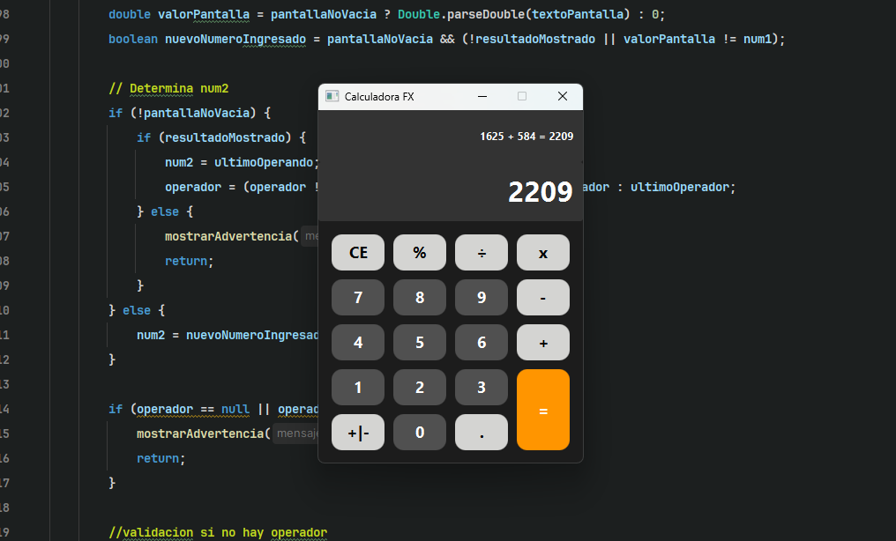

# 🔢 Calculadora Científica FX

> **Aplicación de escritorio para cálculos matemáticos básicos y avanzados, construida completamente en Java utilizando el framework JavaFX. El proyecto sigue un patrón de diseño MVC para una clara separación de la lógica y la interfaz.**

---

    

## 1. 🌟 Características y Funcionalidades

El proyecto proporciona una calculadora funcional con soporte para operaciones aritméticas y lógica de flujo robusta, manejada por el `CalculadoraController`.

* **Operaciones Estándar:** Soporte completo para suma (`+`), resta (`-`), multiplicación (`*`), y división (`÷`).
* **Cálculo de Porcentaje:** Incluye una función (`%`) para calcular y aplicar porcentajes sobre el primer operando.
* **Control Numérico:** Permite el uso de decimales (`.`) y la función de cambio de signo (`+|-`).
* **Historial de Operaciones:** Mantiene una línea de operaciones (`lineaOperaciones`) para visualizar el contexto del cálculo.
* **Manejo de Errores:** Incluye advertencias claras al usuario para casos como la división por cero o la falta de un operador.
* **Formatos de Pantalla:** Formatea resultados complejos mostrando hasta 9 decimales o simplificando a enteros si no hay parte fraccionaria.

---

## 2. 💻 Tecnologías y Arquitectura

Este proyecto está estructurado con el patrón **Modelo-Vista-Controlador (MVC)**, lo que facilita el desarrollo, la prueba y el mantenimiento.

* **Lenguaje Principal:** **Java** (JDK).
* **Interfaz de Usuario (Vista):** **JavaFX** (Clase `EntornoGrafico_fx`). Utiliza `GridPane` y `VBox` para un diseño responsive y control de estilos vía CSS.
* **Lógica de Negocio (Controlador):** Clase `CalculadoraController`. Maneja todas las operaciones matemáticas y el control de estado de la calculadora.
* **Estilización:** Hoja de estilos externa (`style.css`) para una presentación moderna y personalizable.

---

## 3. ⚙️ Instalación y Ejecución

Dado que se trata de una aplicación JavaFX moderna, se recomienda el uso de un gestor de dependencias (Maven o Gradle) para integrar correctamente las librerías.

### Paso 1: Clonar el Repositorio

Clona este repositorio en tu máquina local.

### Paso 2: Configurar el Entorno

1.  Asegúrate de tener instalado el **Java Development Kit (JDK)** (versión 17 o superior es ideal para JavaFX).
2.  Si el proyecto usa Maven o Gradle, ejecuta el comando de construcción (`mvn clean install` o `./gradlew build`) para descargar todas las dependencias de JavaFX.

### Paso 3: Ejecución

Ejecuta la aplicación a través de tu IDE (IntelliJ, Eclipse, VSCode) ejecutando la clase principal que extiende `javafx.application.Application`:

* Clase de Ejecución: `com.locks.calculadora.model.EntornoGrafico_fx`

---

## 4. 🎨 Estructura del Layout

La interfaz se compone de dos `TextField` de solo lectura (la línea de operaciones y la pantalla principal) organizados con un **`VBox`** padre, y un **`GridPane`** para la disposición de los botones.

* El botón **`=` (Igual)** ocupa **dos filas** en el `GridPane`, una técnica de diseño utilizada para optimizar el espacio visual.

***
